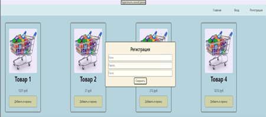
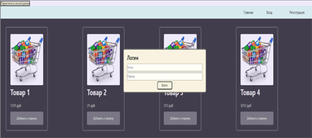
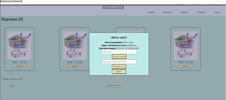
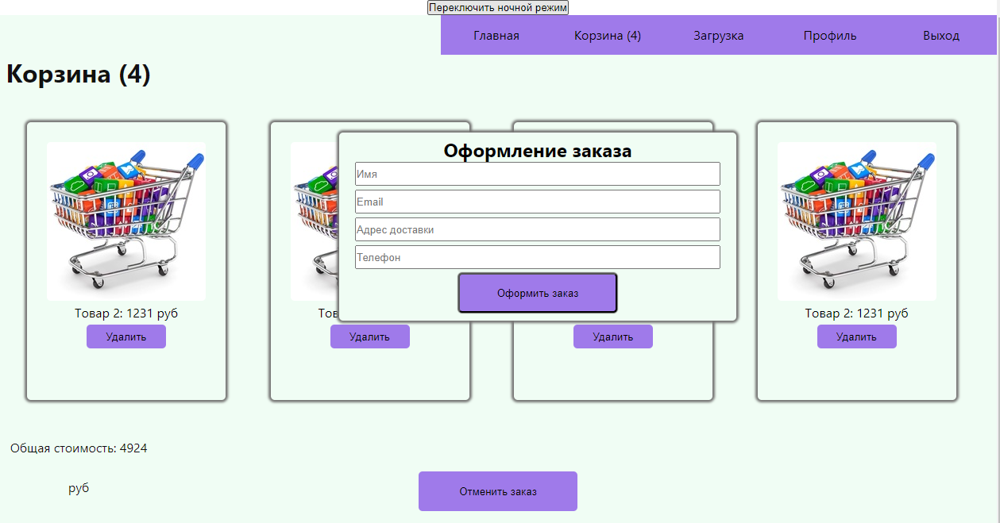
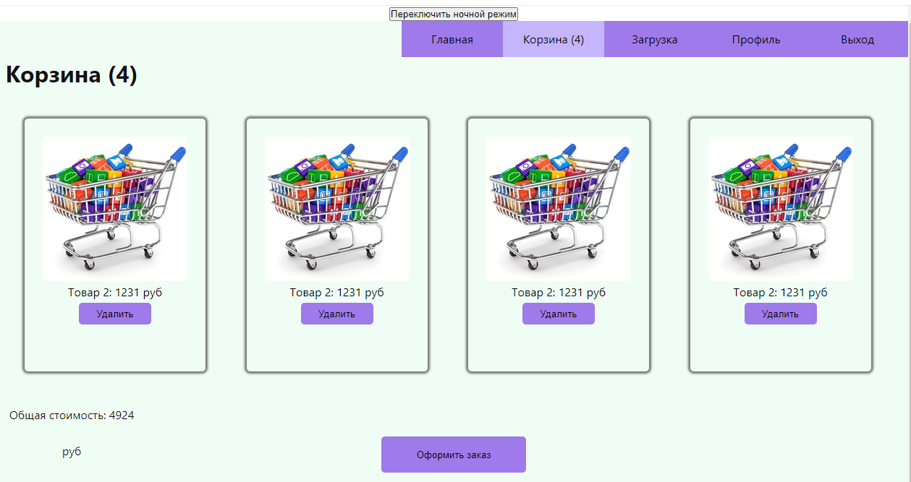

# Демо приложение React для продажи товаров / 
# The React demo application for selling products
 ##  Работает на базе node.js + mongodb
      настроена аутентификация с  ролям.
      две роли: admin и user.
      роль admin имеет возможность создавать товар с изображением. 
      изображение сохраняется на сервере в виде файла с ссылкой в базу данных.
      роль user имеет возможность оформить заказ, заказ сохраняется в базе данных.
      Для удобства при добавление товара указан счетчик товара на корзине сколько товаров добавлено.
      Пользователь имеет свой профиль где можно изменить пароль и почту.
      Имеет два режиме день и ночь.
      Создавалось в качестве учебных задач.
    
 ## it works on the basis of node.js + mongodb
    authentication with roles is configured.
    two roles: admin and user.
    The admin role has the ability to create a product with an image.
    the image is saved on the server as a file with a link to the database.
    The user role has the ability to place an order, the order is saved in the database.
    For convenience, when adding an item, the item counter is indicated on the cart for how many items have been added.
    The user has his own profile where you can change the password and email.
    It has two modes day and night.
    It was created as educational tasks.

